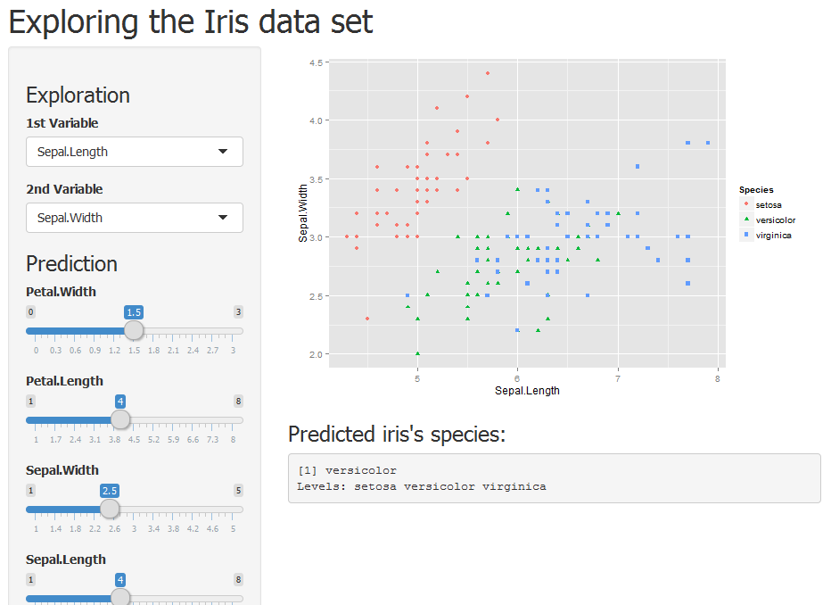

## Iris Dataset Exploration Tool - Intro

This presentation is created for the course project of the developing data products course and showcase the usage of these two tools:

1. `shiny` to create an interactive explorer for Iris dataset
2. `slidify` to create this presentation

--- .class #id 

## Application

The application allows the user to:
1. Explore the dataset by looking at the relationship between two Iris characteristics (Sepal.Length,Sepal.Width,Petal.Length,Petal.Width) on a graph.
2. Input values to predict Iris species using regression trees

The application is hosted at https://adion.shinyapps.io/devdataprod and the source code can be found at https://github.com/aldion/devdataprod

--- .class #id 

## Screenshot




--- .class #id 


## Prediction

Prediction model is done using recursive partionning and regression trees :

```r
library(caret)
modFit <- train(Species ~ ., method="rpart", data=iris)
print(modFit$finalModel)
```

```
## n= 150 
## 
## node), split, n, loss, yval, (yprob)
##       * denotes terminal node
## 
## 1) root 150 100 setosa (0.33333333 0.33333333 0.33333333)  
##   2) Petal.Length< 2.45 50   0 setosa (1.00000000 0.00000000 0.00000000) *
##   3) Petal.Length>=2.45 100  50 versicolor (0.00000000 0.50000000 0.50000000)  
##     6) Petal.Width< 1.75 54   5 versicolor (0.00000000 0.90740741 0.09259259) *
##     7) Petal.Width>=1.75 46   1 virginica (0.00000000 0.02173913 0.97826087) *
```
 

```r
predict(modFit,data.frame(Sepal.Length,Sepal.Width,Petal.Length,Petal.Width))
```

```
## Error in data.frame(Sepal.Length, Sepal.Width, Petal.Length, Petal.Width): object 'Sepal.Length' not found
```
